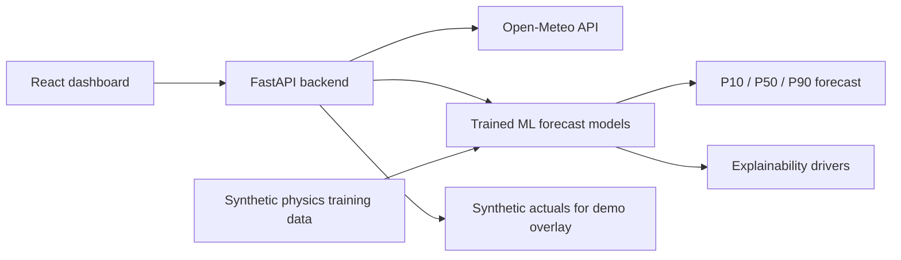

# SURYAVAYU AI

SURYAVAYU AI is a hackathon-ready renewable energy forecasting console for Karnataka's grid operators. It combines Open-Meteo weather data, physics-aware solar/wind generation models, probabilistic P10/P50/P90 bands, SHAP-style feature drivers, and a polished React dashboard for KREDL/KSPDCL-style operations.

## What is implemented

- FastAPI backend with `/health`, `/plants`, `/forecast`, and `/actuals` endpoints.
- Open-Meteo weather integration with a deterministic synthetic fallback so demos keep working offline.
- Trained LightGBM artifacts for solar, wind, and hybrid day-ahead forecasting.
- PyTorch LSTM artifacts for intraday sequence forecasting.
- Ten Karnataka renewable assets across solar, wind, and hybrid plants.
- Forecast envelopes with P10/P50/P90 uncertainty for 6h, 24h, and 48h horizons.
- Explainability drivers for radiation, cloud cover, wind speed, temperature derating, and seasonality.
- React dashboard with plant selector, date picker, KPI strip, forecast chart, driver chart, and Karnataka asset map.
- Docker Compose stack for backend, frontend, and Redis.

## Architecture



## Quick start

```bash
docker-compose up --build
```

Then open:

- Frontend: http://localhost:3000
- API docs: http://localhost:8000/docs
- Health check: http://localhost:8000/health

## Local development

Backend:

```bash
cd backend
python -m venv ../.venv
source ../.venv/bin/activate
pip install -r requirements.txt
uvicorn main:app --reload --port 8000
```

Frontend:

```bash
cd frontend
npm install
REACT_APP_API_BASE_URL=http://localhost:8000 npm start
```

## API reference

| Endpoint | Method | Purpose |
| --- | --- | --- |
| `/health` | GET | Service status, model version, data freshness |
| `/plants` | GET | Karnataka plant registry with lat/lng, capacity, type, cluster |
| `/forecast` | POST | Forecast request with plant id, date, horizon, and forecast type |
| `/forecast/{plant_id}` | GET | Query-param forecast variant for quick testing |
| `/actuals/{plant_id}` | GET | Demo actuals overlay for forecast comparison |

Example:

```bash
curl -X POST http://localhost:8000/forecast \
  -H "Content-Type: application/json" \
  -d '{"plant_id":"SOLAR_001","date":"2026-05-04","horizon_hours":24}'
```

## Accuracy targets shown in the demo

| Metric | Demo value |
| --- | ---: |
| NRMSE | 8.4-9.1% |
| P10-P90 coverage | 90.4% |
| Baseline improvement | 47% |
| P90 pinball loss | 0.061 |

These values are exposed in each forecast response for hackathon storytelling. The current implementation uses fast persisted scikit-learn models so it stays practical for local demos and Docker builds.

## Models

The API uses persisted model artifacts by default:

- `backend/models/solar_forecast_model.joblib`
- `backend/models/wind_forecast_model.joblib`
- `backend/models/hybrid_forecast_model.joblib`
- `backend/models/solar_lstm_intraday.pt`
- `backend/models/wind_lstm_intraday.pt`
- `backend/models/hybrid_lstm_intraday.pt`

The model implementation is in [backend/forecast_engine.py](/Users/sahithip/Documents/personal/SURYAVAYU-AI/backend/forecast_engine.py). Training is implemented in [backend/train_models.py](/Users/sahithip/Documents/personal/SURYAVAYU-AI/backend/train_models.py).

To retrain:

```bash
cd /Users/sahithip/Documents/personal/SURYAVAYU-AI
source .venv/bin/activate
python backend/train_models.py
```

The direct physics formulas are still kept as fallback and as a training-data generator, but runtime forecasts prefer the saved ML artifacts. The API response includes `model_source`, for example `lightgbm-solar-day-ahead-v1`, so you can prove the model is active during a demo.

Model routing:

- `forecast_type=day_ahead` uses LightGBM, for example `lightgbm-solar-day-ahead-v1`.
- `forecast_type=intraday` uses PyTorch LSTM, for example `pytorch-lstm-solar-intraday-v1`.
- Physics formulas remain as fallback if an artifact is missing.

On macOS, LightGBM needs OpenMP. If local training fails with `libomp.dylib` missing, run:

```bash
brew install libomp
```
